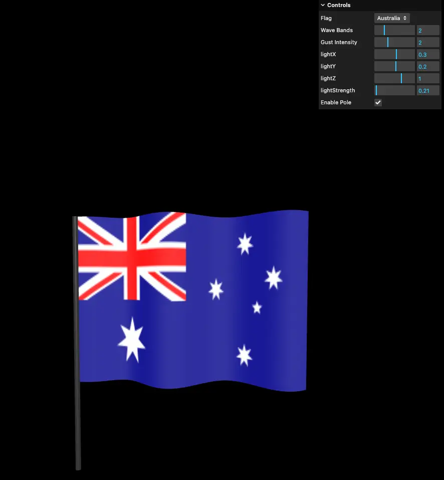

# Animated Flag with Pole – Three.js & GLSL Demo

This is a visual demo project built with **Three.js** and **GLSL shaders**, showcasing animated flag wave effects with optional pole-based falloff. The project features an interactive GUI to control wind bands, gust intensity, lighting direction, and pole effects.

> ⚠️ This is a **trial project** created as part of my journey to master advanced techniques in **Three.js** and **GLSL shader programming**.

---

## 🌐 Live Demo

[🔗 View Live Demo](https://rachet-khanal.github.io/animated-flag-threejs-demo/)

---

## 🔧 Technologies Used

- [Three.js](https://threejs.org/) – 3D rendering engine
- [GLSL](https://thebookofshaders.com/) – for custom vertex and fragment shaders
- [lil-gui](https://github.com/georgealways/lil-gui) – UI controls
- `OrbitControls` – for scene navigation
- Custom banded noise waves & pole-based displacement falloff

---

## 🚀 How to Run

1. **Clone the repository**

   ```bash
   git clone https://github.com/rachet-khanal/animated-flag-threejs-demo.git
   cd flag-wave-demo
   ```

2. **Install dependencies**
   This project assumes you're using a bundler like **Vite**, **Parcel**, or **Webpack**.
   For example with Vite:

   ```bash
   npm install
   npm run dev
   ```

3. **Open in browser**
   Navigate to `http://localhost:5173/` (or the URL shown in your terminal)

---

## ✨ Features

- Dynamic flag wave animation using banded gusts
- Light direction control that affects both shader and pole
- Pole toggle with wave falloff effect
- Supports alpha-mapped flags (e.g., PNGs with transparency)
- Fully interactive via GUI controls

---

## 🎛 Controls via GUI

- **Wave Bands** – Number of wind wave bands
- **Gust Intensity** – Controls turbulence
- **Light Direction & Strength** – Affects shading and pole highlights
- **Enable Pole** – Toggle pole + wave falloff
- **Pole Falloff** – Adjust distance-based wave strength

---

## 📁 Project Structure

```
├── components/
│   └── FlagMesh.js        # Generates flag geometry and materials
├── shaders/
│   ├── vertex.glsl        # Custom vertex shader for waving
│   └── fragment.glsl      # Texture and alpha handling
├── utils/
│   └── sizes.js           # Responsive camera/resizing logic
├── static/
│   └── flags/             # Flag images with optional alpha maps
├── public/
│   └── screenshot.webp
├── main.js                # Entry point, sets up scene & GUI
└── index.html
```

---

## 📸 Screenshots



---

## 📚 Credits

- Flag icons sourced from [flagdownload.com](https://flagdownload.com)

---

## 🧪 Future Improvements

- Realistic cloth simulation
- Environment reflection on pole
- Performance tuning for mobile

---

## 📬 Contact

Feel free to reach out if you'd like to collaborate or give feedback!
